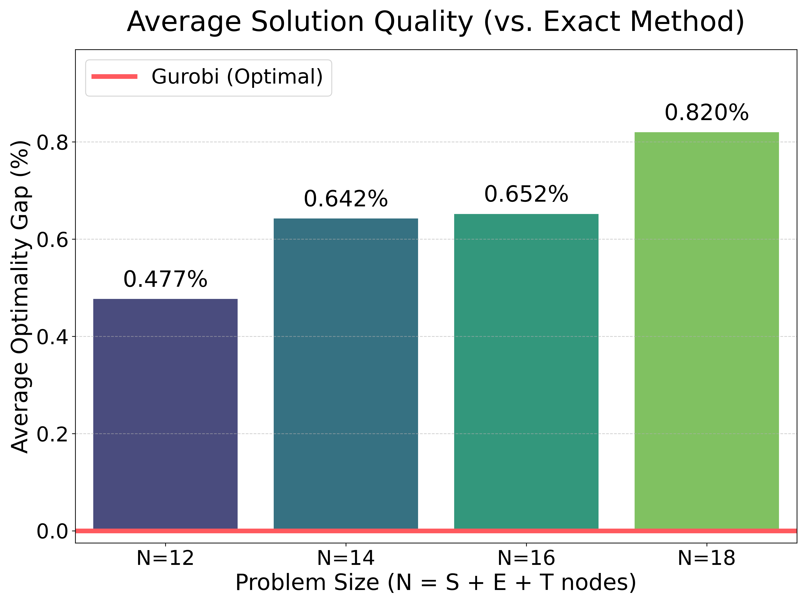
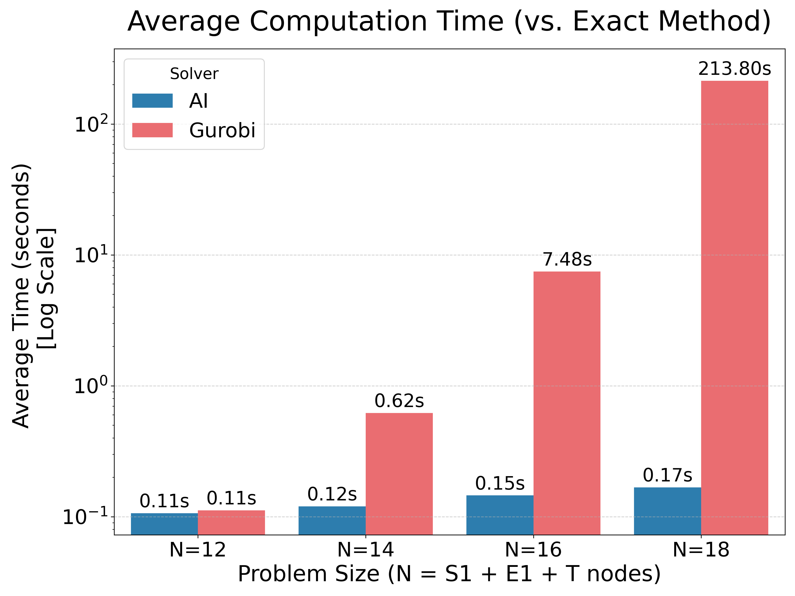

# 🛒 ShoppinGo: 오프라인 마트 최적 쇼핑 경로 추천 서비스

- **팀명 :** 광교산 경로당
- **교과목 :** AI융합캡스톤디자인2 (25-2학기)
- **프로젝트 내용 :** AI 기반의 오프라인 마트 최적 쇼핑 경로 추천 서비스 개발

## 🚀 1. 프로젝트 개요

- 오프라인 마트 고객을 위한 **최적 쇼핑 경로 안내 서비스**
- 사용자가 쇼핑 리스트를 입력하면, AI 모델이 매장 구조와 상품 위치를 분석하여 **가장 효율적인 쇼핑 경로를 실시간으로 추천**

## 💡 2. 핵심 기술 및 방법론

### 🧠 AI 기반 경로 탐색 (NCH: Neural Constructive Heuristic)

경로 탐색 문제(Traveling Salesperson Problem, TSP 변형)를 해결하기 위해 **HELD (Heavy Encoder-Light Decoder) 구조의 DNN 모델**을 사용

* **Encoder (Heavy):** 입력된 마트 지도의 구조와 상품 노드 간의 복잡한 관계를 학습, 고차원 임베딩들을 생성

* **Decoder (Light):** Encoder에서 출력된 임베딩들을 바탕으로, 사용자의 쇼핑 리스트에 기반한 최적의 방문 순서를 Autoregressive 방식으로 구성 

    → **"End-to-End" Framework**

### 📈 Multi-Policy & Self Imitation Learning (SIL)

* **Multi-Policy (다중 정책)** : 샘플링된 잠재변수 ($z$)를 디코더의 입력 임베딩에 연결(Concatenation)함으로써, 단일 DNN 모델을 통해 다양한 행동 정책을 표현하고 탐색
    * 하나의 문제 인스턴스에 대해 여러 정책($z$)을 병렬적으로 탐색하여 다양한 해를 도출하고, 그중 가장 낮은 비용을 가지는 최적의 해를 채택하여 해의 품질을 향상할 수 있음
*  **Self Imitation Learning (자기 모방 학습)** : 여러 정책이 생성한 해들 중 **가장 비용이 낮은 해**를 선택하여 집중적으로 모방 학습
    * 스스로 정답지(pseudo-label)를 만들고, 이를 모방 학습하는 모델의 성능을 지속적으로 진화시키는 강화 학습(RL) 방법론 중 하나
* 두 가지 조합을 통해 계산 속도와 최종 해의 품질을 모두 향상 → **복잡한 최적화 문제 해결에 강력한 이점을 제공**

## 🔬 3. 프로젝트 결과 및 성능 검증

본 프로젝트는 **AI 모델의 성능 평가**를 위해 최적화 솔버인 **Gurobi의 MIP(Mixed-Integer Programming) 모델**을 기준으로 활용하여 비교 분석을 수행

* **MIP 모델 :** **DFJ(Dantzig–Fulkerson–Johnson) 방식의 Subtour Elimination 제약 조건**을 적용하여 TSP 변형 문제를 모델링
* **구현 경로:** `app/ai/mip_solver.py`

<table>
 <tr>
  <td valign="top" style="padding-right: 20px;">

### 🧪 실험 설정 

| 설정 항목 (Config) | 설정 수치 (Settings) |
| :---: | :---: |
| **Problem Size ($N$)** | [12, 14, 16, 18] (시작점, 도착점 포함) |
| **Instances ($M$)** | 30 (per $N$) |

  </td>
  <td valign="top" style="padding-left: 20px;">

### 📉 비교 분석 지표

AI 모델과 Gurobi MIP 모델을 다음 두 지표를 통해 비교분석:

1.  **Average Optimality Gap (%)** : Gurobi가 도출한 최적해를 기준으로 AI 모델이 찾은 해가 얼마나 근접한지를 백분율로 나타낸 지표
    - 산출 공식 : $$\overline{\text{Gap}} = \frac{1}{M} \sum_{i=1}^{M} \left( \frac{Z_{AI, i} - Z_{Opt., i}}{Z_{Opt., i}} \right) \times 100 (\%)$$
    - $Z_{AI, i}$ : 인스턴스 $i$에 대해 AI 모델이 찾은 경로의 비용
    - $Z_{Opt, i}$ : 인스턴스 $i$에 대해 Gurobi 솔버가 찾은 경로의 비용 (최적해)
2.  **Average Computation Time (s)** : 각 모델의 평균 실행 시간

  </td>
 </tr>
</table>

### 📉 실험 결과 시각화 & 분석 (Results Visualization & Analysis)
- 실험 결과 경로 : `experiments/results/experiments_results_{M}.pkl`

| **1. Average Optimality Gap** | **2. Average Computation Time** |
| :---: | :---: |
|  |  |

1. **Average Optimality Gap 분석** : 
    - 모든 실험 문제 크기($N$)에 걸쳐 AI 모델은 1% 미만의 우수한 Average Optimality Gap을 유지
    - AI 모델이 실제 최적해에 매우 근접한 고품질의 해를 성공적으로 도출했음을 입증
2. **Average Computation Time 분석** :
    - Gurobi 모델은 최적해를 찾기 위해 문제 크기($N$)가 증가할수록 계산 시간이 기하급수적으로 증가
    - 반면, AI 모델은 문제 크기($N$)가 커지더라도 계산 시간의 증가폭이 미미하며, 매우 짧은 시간(밀리초 단위) 내에 해를 도출
    - AI 모델은 복잡한 문제($N$이 큰 문제)를 처리할 때 Gurobi MIP 모델 대비 **뛰어난 계산 시간 효율성**을 제공하여, **실시간 의사 결정 환경**에 훨씬 더 적합

## 🛠️ 4. 기술 스택

| 카테고리 | 기술 스택 | 
| :---: | :---: | 
| **🤖 AI Model Core** |    | 
| **🖥️ Backend & Server** |  | 
| **💾 Database** |  | 
| **📱 Frontend & UI/UX** |  | 
| **🛠️ Development & Tools** |    | 

## 🧑‍💻 5. 프로젝트 참여자

| 이름 | 역할 | 학과 | 이메일 | 
| :---: | :---: | :---: | :---: | 
| **윤승규** | PM, AI 모델 개발 | 산업공학과 | skyoon1109@ajou.ac.kr | 
| **황규헌** | 프론트엔드 개발, UI/UX | 수학과 | modkiserman@ajou.ac.kr | 
| **김민석** | 백엔드 개발, DB 설게 | 심리학과 | minseok0606@ajou.ac.kr | 
| **박진호** | 백엔드 개발, DB 설계 | 심리학과 | jinhopark@ajou.ac.kr |
